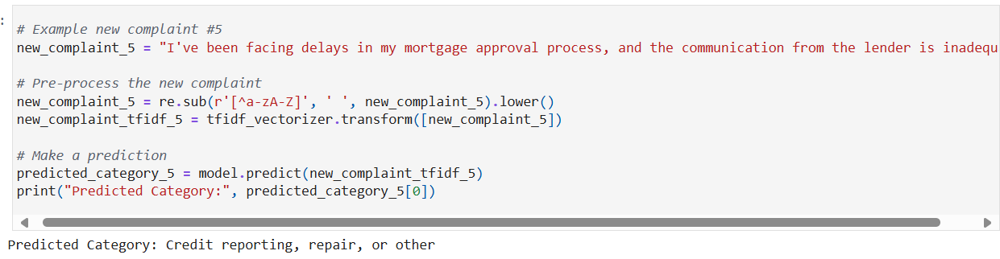

# Consumer Complaints Text Classification

This repository contains a text classification system for categorizing consumer complaints into specific categories: Credit Reporting, Debt Collection, Consumer Loan, and Mortgage. The system automates labeling to support effective complaint management.

## Table of Contents

- [Project Structure](#project-structure)  
- [Features](#features)  
- [Tech Stack](#tech-stack)  
- [Requirements](#requirements)  
- [Installation](#installation)  
- [Usage](#usage)  
- [Pipeline Overview](#pipeline-overview)  
- [Screenshots](#screenshots)

## Project Structure

- `text-classification.html` — HTML export of the notebook  
- `text-classification.ipynb` — Jupyter notebook with full implementation  
- `README.md` — Project documentation  
- `requirements.txt` — Python package dependencies  

## Features

- Multi-class text classification into four categories  
- Text preprocessing including cleaning and tokenization  
- Model training and evaluation using machine learning algorithms  
- Performance evaluation with accuracy metrics and confusion matrices  
- Prediction on new consumer complaint texts  

## Tech Stack

- Python  
- scikit-learn  
- pandas  
- matplotlib  
- Jupyter Notebook  

## Requirements

- Python 3.x  
- Packages listed in `requirements.txt`  

## Installation

1. Clone the repository:
   ```bash
   git clone https://github.com/yourusername/Consumer-Complaints-Text-Classification.git
   cd Consumer-Complaints-Text-Classification


## Screenshots

### Accuracy


### Confusion Matrix


### Prediction Example


